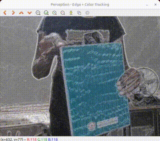
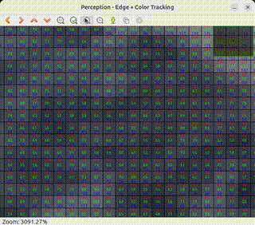
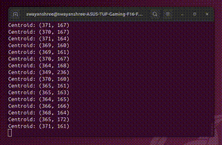

# TASK 4: Perception

## Edge Detection & Color Tracking:
**Edge Detection:** Implement the edge detector operator to locate edges in specific directions in **x or y**.

**Color Tracking:** Track a particular color from the camera stream and provide the centroid of the color to the terminal.

### Here, I have chosen **Red** Colour for tracking.







## Terminal Code:

```bash
source install/setup.bash
ros2 run perception p_edge_color
```

> To Watch the Demo Videos and Images: [Click Here](https://drive.google.com/drive/folders/1Jf9TPWPhs3FzPAMwE5lNOGVHmVa2BfRJ?usp=drive_link)

