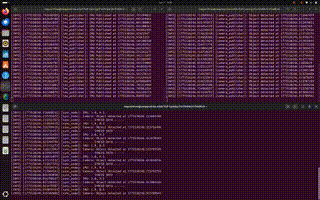

# ROS2 COMMUNICATION : Data Sync

**align messages from multiple sensors (e.g., IMU and Camera) based on their header timestamps.** 



```bash
source ~/my_ws/install/setup.bash
```

## Terminal 1: IMU publisher
```bash
ros2 run data_sync_pkg imu_pub
```

## Terminal 2: Camera publisher
```bash
ros2 run data_sync_pkg cam_pub
```

## Terminal 3: Sync subscriber
```bash
ros2 run data_sync_pkg sync_node
```

> To Watch the Demo Videos and Images: [Click Here](https://drive.google.com/drive/folders/1Jf9TPWPhs3FzPAMwE5lNOGVHmVa2BfRJ?usp=drive_link)

