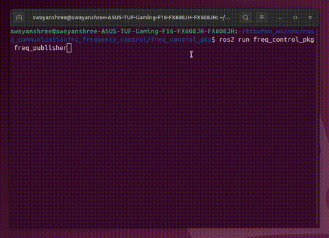

# ROS2 COMMUNICATION : Frequency Control

**to ensure the publisher maintains a Frequency.**

 
 
## Terminal Code:
```bash 
 source ~/tiburon_ws/install/setup.bash
 ros2 run freq_control_pkg freq_publisher
 ```
 
