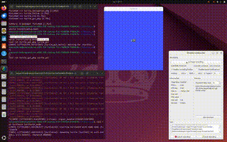
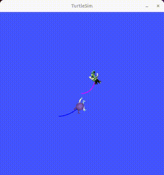

# TASK 1 : Turtle Simulation

This module demonstrates basic ROS2 concepts using turtlesim, including motion control, services, GUI interaction, and multi-agent behavior.

i).   Shape Drawing   --> ts_shape_drawing

ii).  Navigation      --> ts_navigation

iii). GUI Services    --> ts_gui_services

iv).  Follow the Girl --> ts_follow_the_girl

## Prerequisites

Ensure the workspace is built and sourced:

```bash
cd ~/my_ws
colcon build
source install/setup.bash
```

## Run turtlesim:

```bash
ros2 run turtlesim turtlesim_node
```






> To Watch The Demo Videos and Images: [Click Here](https://drive.google.com/drive/folders/1Jf9TPWPhs3FzPAMwE5lNOGVHmVa2BfRJ?usp=drive_link)

