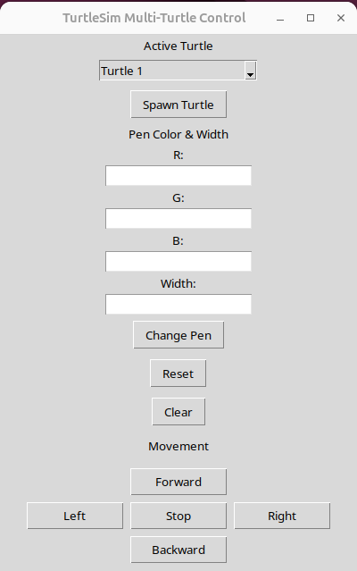

# TURTLE SIMULATION : GUI Services

**Use Python Tkinter or PyQt to create buttons that call ROS2 services like reset, clear, or spawn turtles or change color of pen of turtle**



Updated GUI controls. Not same as the gif below. Screen maximize issue solved.


> Watch the full demo [here](https://drive.google.com/file/d/1lvBc8dLjjm3OiFL19Wc-HcDPhxq2roky/view?usp=drive_link)

```bash
cd ~/tiburon_ws
colcon build
```

## Terminal 1:
```bash
source install/setup.bash
ros2 run turtlesim turtlesim_node
```

## Terminal 2:
```bash
source install/setup.bash
ros2 run turtle_gui_pkg turtle_gui
```
**Now operate different turtles using the GUI control dialog box that appears.**

> To Watch the Demo Videos and Images: [Click Here](https://drive.google.com/drive/folders/1Jf9TPWPhs3FzPAMwE5lNOGVHmVa2BfRJ?usp=drive_link)

