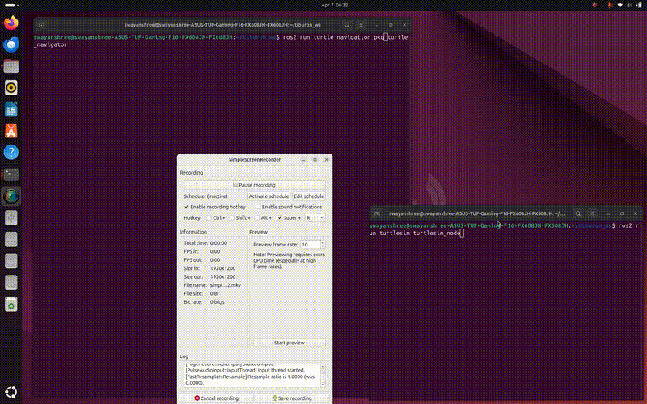

# TURTLE SIMULATION : Navigation

**Navigate through different positions that can be given at runtime.**



## Terminal 1:
```bash
ros2 run turtlesim turtlesim_node
```

## Terminal 2:
```bash
cd ~/tiburon_ws
colcon build
source install/setup.bash
ros2 run ts_navigation turtle_navigator
```
##  Usage

Enter target coordinates when prompted:

```bash
Enter target x:
Enter target y:
```

Example:

```bash
2
4
```

Turtle moves to the specified position and stops.

**Program continues to accept new coordinates.**

> To Watch the Demo Videos and Images: [Click Here](https://drive.google.com/drive/folders/1Jf9TPWPhs3FzPAMwE5lNOGVHmVa2BfRJ?usp=drive_link)

