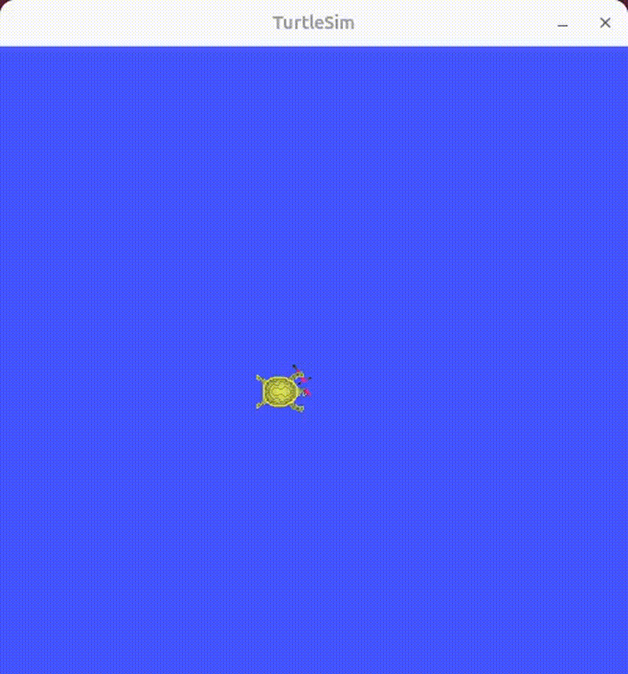

#TURTLE SIMULATION : Shape Drawing

**draw square, triangle, cube shape using turtlesim**



```bash
cd ~/tiburon_ws
colcon build
source install/setup.bash
```

##Terminal 1:

```bash
ros2 run turtlesim turtlesim_node
```

##Terminal 2

```bash
ros2 run ts_shape_drawing draw_square
ros2 run ts_shape_drawing draw_triangle
ros2 run ts_shape_drawing draw_cube
```

