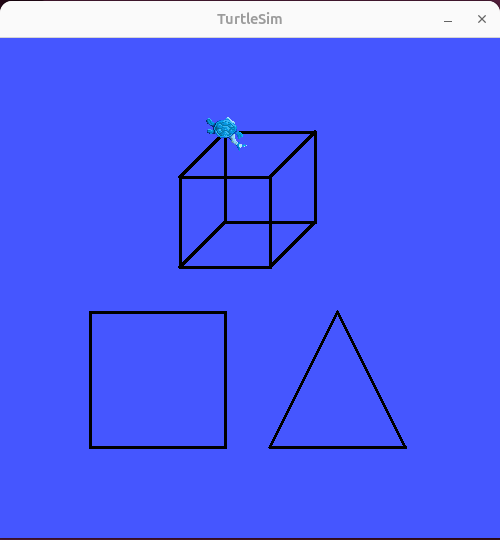

# TURTLE SIMULATION : Shape Drawing

**draw square, triangle, cube shape using turtlesim**




```bash
cd ~/my_ws
colcon build
source install/setup.bash
```

## Terminal 1:

```bash
ros2 run turtlesim turtlesim_node
```

## Terminal 2

```bash
ros2 run ts_shape_drawing draw_square
ros2 run ts_shape_drawing draw_triangle
ros2 run ts_shape_drawing draw_cube
```

> To Watch the Demo Videos and Images: [Click Here](https://drive.google.com/drive/folders/1Jf9TPWPhs3FzPAMwE5lNOGVHmVa2BfRJ?usp=drive_link)

